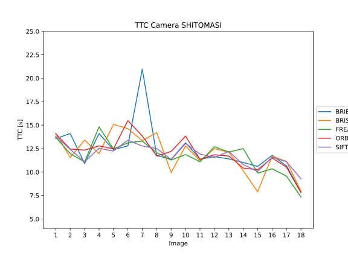

# SFND 3D Object Tracking

Welcome to the final project of the camera course. By completing all the lessons, you now have a solid understanding of keypoint detectors, descriptors, and methods to match them between successive images. Also, you know how to detect objects in an image using the YOLO deep-learning framework. And finally, you know how to associate regions in a camera image with Lidar points in 3D space. Let's take a look at our program schematic to see what we already have accomplished and what's still missing.


In this final project, you will implement the missing parts in the schematic. To do this, you will complete four major tasks: 
1. First, you will develop a way to match 3D objects over time by using keypoint correspondences. 
2. Second, you will compute the TTC based on Lidar measurements. 
3. You will then proceed to do the same using the camera, which requires to first associate keypoint matches to regions of interest and then to compute the TTC based on those matches. 
4. And lastly, you will conduct various tests with the framework. Your goal is to identify the most suitable detector/descriptor combination for TTC estimation and also to search for problems that can lead to faulty measurements by the camera or Lidar sensor. In the last course of this Nanodegree, you will learn about the Kalman filter, which is a great way to combine the two independent TTC measurements into an improved version which is much more reliable than a single sensor alone can be. But before we think about such things, let us focus on your final project in the camera course. 

## Dependencies for Running Locally
* cmake >= 2.8
  * All OSes: [click here for installation instructions](https://cmake.org/install/)
* make >= 4.1 (Linux, Mac), 3.81 (Windows)
  * Linux: make is installed by default on most Linux distros
  * Mac: [install Xcode command line tools to get make](https://developer.apple.com/xcode/features/)
  * Windows: [Click here for installation instructions](http://gnuwin32.sourceforge.net/packages/make.htm)
* Git LFS
  * Weight files are handled using [LFS](https://git-lfs.github.com/)
* OpenCV >= 4.1
  * This must be compiled from source using the `-D OPENCV_ENABLE_NONFREE=ON` cmake flag for testing the SIFT and SURF detectors.
  * The OpenCV 4.1.0 source code can be found [here](https://github.com/opencv/opencv/tree/4.1.0)
* gcc/g++ >= 7.0
  * I opted for a C++17 feature (structured bindings) that is only available with GCC 7 and upwards 
  * Linux: gcc / g++ is installed by default on most Linux distros
  * Mac: same deal as make - [install Xcode command line tools](https://developer.apple.com/xcode/features/)
  * Windows: recommend using [MinGW](http://www.mingw.org/)

## Basic Build Instructions

1. Clone this repo.
2. Make a build directory in the top level project directory: `mkdir build && cd build`
3. Compile: `cmake .. && make`
4. Run it: `./3D_object_tracking`.

## Results
#### FP.1 Match 3D Objects
As suggested I'm looping over all matches and count the bounding box pairs. The second step is to sort the pairs for most matches. 
I'm doing this using a multimap because it's automatically sorted. Finally, the best matches are stored in `bbBestMatches`.

#### FP.2 Compute Lidar-based TTC
Following the lecture, the TTC for Lidar is computed. To filter out outliers to a certain extent, PCL's `pcl::StatisticalOutlierRemoval<PointT>`
is used. Furthermore, I tried to solve the problem using the median of the 15% closest points.

#### FP.3 Associate Keypoint Correspondences with Bounding Boxes
First, all keypoints that are not within the ROI of the bounding box are filtered out. In a second step, all matches with distances 
outside of the standard deviation from the median are removed.

#### FP.4 Compute Camera-based TTC
The camera-based TTC is computed as discussed in the lecture.

#### FP.5 Performance Evaluation 1

I tried two methods to get a more robust method, however, neither of them gives completely satisfying
results. I guess a Kalman filter would help to improve the quality of the TTC estimate. The plot "TTC Lidar" shows the problem
of a "jumping" TTC estimate, e.g. the jump from image six to seven is almost 30s for stochastical
outlier filtering.   
Methods tried:

- Stochastical outlier filtering from PCL library:
    ```cpp
    pcl::StatisticalOutlierRemoval<pcl::PointXYZ> sorfilter;
    sorfilter.setInputCloud(cloud_in);
    sorfilter.setMeanK(20);
    sorfilter.setStddevMulThresh(1.0);
    sorfilter.filter(*result);
    ```  
 - Median Filter:  
 Sorting the Lidar points for their x-values in ascending order and taking the median value of the lowest 15% gives a
 result that is a little bit more robust, however, the threshold is quite sensitive and the jumps go up quickly, e.g. when using
 10%.
 
 The cause of error is very likely the varying relative speed, since `xmin` reduces almost linearly as the KITTI vehicle approaches the
 other car.
 
 #### FP.6 Performance Evaluation 2
 Unfortunately it's quite hard to quantify the performance of the camera based TTC estimators as we don't have a ground
 truth. 
 
 However, the plots below give a good impression, on which combinations work better than others. Combinations of Harris and ORB detectors
 almost never work. SHITOMASI, AKAZE, BRISK and SIFT detectors work quite well with all descriptors. The winner from the Midterm project 
 (FAST with BRIEF descriptor) works okay here, but would not be my first choice. This would probably be SHITOMASI with ORB descriptors.
  
 
 
 
 
 
 
 